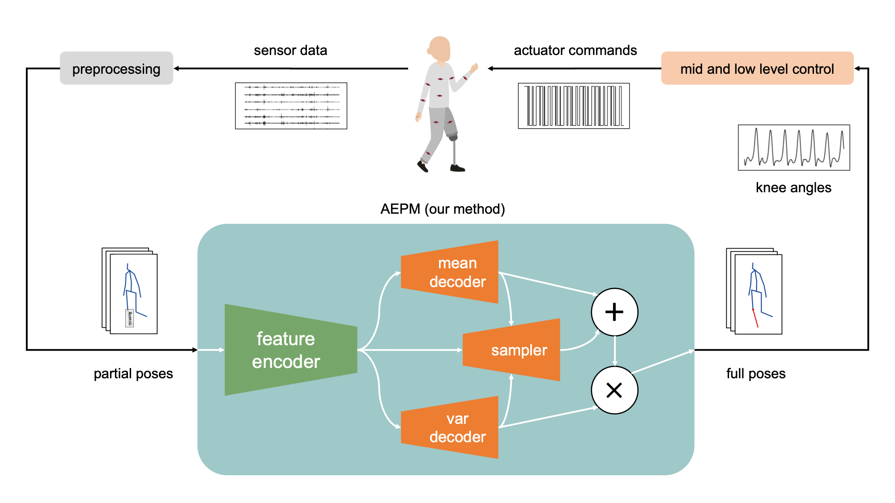
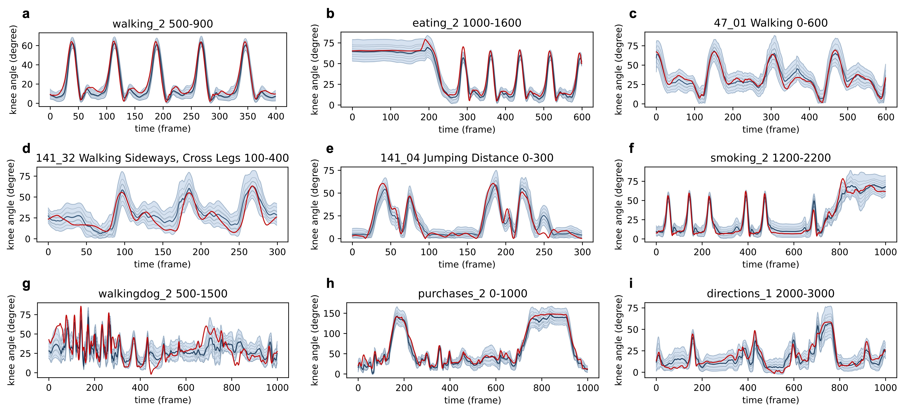

# Beyond Gait: AEPM

**Beyond Gait: Seamless Knee Angle Prediction for Lower Limb Prosthesis in Multiple Scenarios**  
Pengwei Wang, Yilong Chen, Wan Su, Jie Wang, Teng Ma, Haoyong Yu  
[https://arxiv.org/abs/2404.06772](https://arxiv.org/abs/2404.06772)




Abstract: *Knee angle estimation plays a crucial role in the development of lower limb assistive devices, particularly prostheses. Current research in this area primarily focuses on stable gait movements, which limits applicability to real-world scenarios where human motion is far more complex. In this paper, we focus on estimating the knee angle in a broader range of activities beyond simple gait movements. By leveraging the synergy of whole-body dynamics, we propose a transformer-based probabilistic framework, the Angle Estimation Probabilistic Model (AEPM), which offers precise knee angle estimation across various daily movements. AEPM achieves an overall RMSE of 6.83 degrees, with an RMSE of 2.93 degrees in walking scenarios, outperforming the current state of the art with a 24.68\% improvement in walking prediction accuracy. Additionally, our method can achieve seamless adaptation between different locomotion modes. Also, this model can be utilized to analyze the synergy between the knee and other joints. We reveal that the whole body movement has valuable information for knee movement, which can provide insights into designing sensors for prostheses.*

## Getting Started
### Environment
```shell
conda create -n aepm python=3.8
conda activate aepm
pip install torch==2.0.0 torchvision==0.15.1 torchaudio==2.0.1
pip install einops timm matplotlib tensorboard
```

### Data Preparation
Structure Human3.6M dataset as follows, only txt files are needed. The `base_path` and `dataset_path` can be set in `config.py`.
```
- h36m
    - S1
        - discussion_1.txt
        - discussion_2.txt
        - walking_1.txt
        - ...
    - S5
    - ...
```

### Training
```shell
python train.py
```

## Acknowledgement
The MixSTE code is referenced from [MixSTE](https://github.com/JinluZhang1126/MixSTE) and [D3DP](https://github.com/paTRICK-swk/D3DP).
