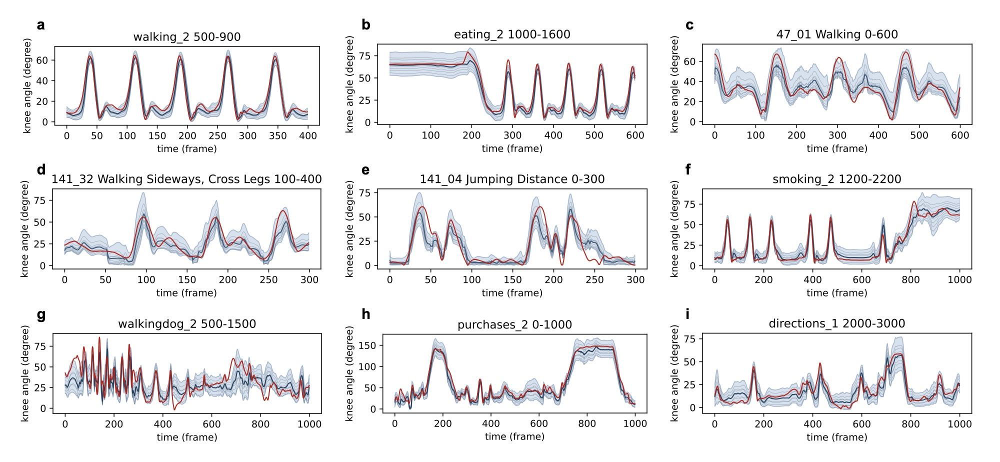

# Beyond Gait: AEPM

**Beyond Gait: Learning knee angle for seamless prosthesis control in multiple scenarios**  
Pengwei Wang, Yilong Chen, Wan Su, Jie Wang, Teng Ma, Haoyong Yu
[https://arxiv.org/abs/2404.06772](https://arxiv.org/abs/2404.06772)




Abstract: *Deep learning models have become a powerful tool in knee angle estimation for lower limb prostheses, owing to their adaptability across various gait phases and locomotion modes. Current methods utilize Multi-Layer Perceptrons (MLP), Long-Short Term Memory Networks (LSTM), and Convolutional Neural Networks (CNN), predominantly analyzing motion information from the thigh. Contrary to these approaches, our study introduces a holistic perspective by integrating whole-body movements as inputs. We propose a transformer-based probabilistic framework, termed the Angle Estimation Probabilistic Model (AEPM), that offers precise angle estimations across extensive scenarios beyond walking. AEPM achieves an overall RMSE of 6.70 degrees, with an RMSE of 3.45 degrees in walking scenarios. Compared to the state of the art, AEPM has improved the prediction accuracy for walking by 11.31%. Our method can achieve seamless adaptation between different locomotion modes. Also, this model can be utilized to analyze the synergy between the knee and other joints. We reveal that the whole body movement has valuable information for knee movement, which can provide insights into designing sensors for prostheses.*

## Getting Started
### Environment
```shell
conda create -n aepm python=3.8
conda activate aepm
pip install torch==2.0.0 torchvision==0.15.1 torchaudio==2.0.1
pip install einops timm matplotlib tensorboard
```

### Data Preparation
Structure Human3.6M dataset as follows, only txt files are needed. The `base_path` and `dataset_path` can be set in `config.py`.
```
- h36m
    - S1
        - discussion_1.txt
        - discussion_2.txt
        - walking_1.txt
        - ...
    - S5
    - ...
```

### Training
```shell
python train.py
```

## Acknowledgement
The MixSTE code is referenced from [MixSTE](https://github.com/JinluZhang1126/MixSTE) and [D3DP](https://github.com/paTRICK-swk/D3DP).