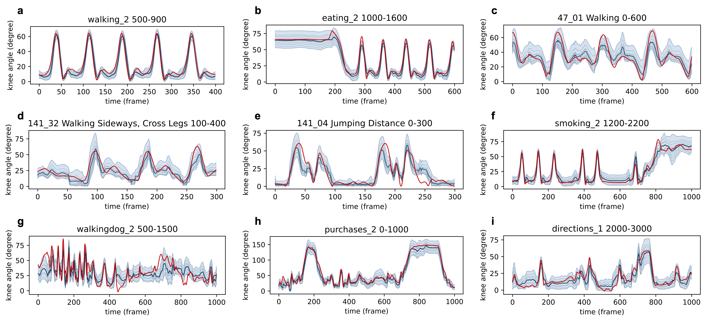

# Beyond Gait: AEPM

**Beyond Gait: Learning knee angle for seamless prosthesis control in multiple scenarios**  
Pengwei Wang, Yilong Chen, Wan Su, Jie Wang, Teng Ma, Haoyong Yu

Figure below: overview of the proposed AEPM framework.



## Getting Started
### Environment
```shell
conda create -n aepm python=3.8
conda activate aepm
pip install torch==2.0.0 torchvision==0.15.1 torchaudio==2.0.1
pip install einops timm matplotlib tensorboard
```

### Data Preparation
Structure Human3.6M dataset as follows, only txt files are needed. Basic setting can be found in `config.py`.
```
- h36m
    - S1
        - discussion_1.txt
        - discussion_2.txt
        - walking_1.txt
        - ...
    - S5
    - ...
```

### Training
```shell
python train.py
```

## Acknowledgement
The MixSTE code is referenced from [MixSTE](https://github.com/JinluZhang1126/MixSTE) and [D3DP](https://github.com/paTRICK-swk/D3DP).